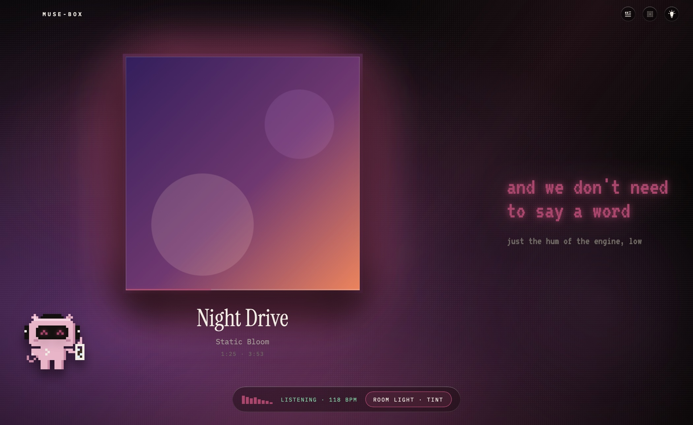
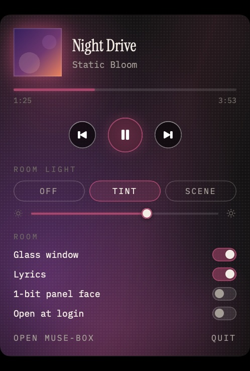

# muse-box for macOS

The muse-box room as a native Mac app: the album's light fills the window
and, if you want, your whole desktop, pulsing on the beat of whatever Spotify
is playing. Same look as the web client (the dot screen, the swaying sleeve,
the CRT karaoke, Bitka), rebuilt in SwiftUI and Core Animation, with real
frosted glass (Liquid Glass on macOS 26).



**No Spotify login. No developer app. No API keys.** It follows the Spotify
desktop app that is already on your Mac, so you can hand it to anyone.

## Why not the Spotify Web API

The web client and the shelf box go through the backend, which signs in to
the Web API. That is fine for one person, but since February 2026 a Web API
app in development mode works for at most five accounts you add by hand (and
its owner needs Premium), and lifting that limit means applying for extended
quota, which Spotify only grants to organisations with 250k monthly users. An
app you want to give to friends cannot depend on it.

So the Mac app does not talk to the Web API at all. Everything it needs is
already on the machine or public:

| Needs | Where it comes from | Permission |
|-------|---------------------|------------|
| What is playing, play/pause, seeks | Spotify's own `com.spotify.client.PlaybackStateChanged` broadcast | none |
| Cover URL, exact position, transport keys | Spotify's AppleScript dictionary | "control Spotify" (once) |
| Cover image | Spotify's CDN, or its public oEmbed endpoint without the permission above | none |
| Palette, 1-bit panel face, idle clock | computed locally, ported from `src/image.rs` and `src/idle.rs` | none |
| Time-synced lyrics | [LRCLIB](https://lrclib.net), as in `src/lyrics.rs` | none |
| The beat | a Core Audio tap on Spotify's output, analysed live | System Audio Recording (once) |

## What it does

- **The room.** Cover, title, times, and karaoke lyrics one line at a time,
  over the album's light: the same six layers as `web/src/styles.css` (wash,
  halo, glow, sheen, two orbs), the halftone dot screen and the vignette.
  The window itself is frosted glass over your desktop.
- **Room light** puts that light on the desktop, under your icons and above
  the wallpaper, on every display and Space. **Tint** washes the album's
  colours over your own wallpaper; **Scene** makes the whole muse-box room the
  desktop. Because it sits under everything, the Dock, the menu bar and every
  translucent window pick the colour up too.

  | Your desktop | With Tint |
  |---|---|
  |  |  |

- **It hears the beat.** The web client can only guess the pulse, because the
  audio never reaches the browser and Spotify retired its audio-analysis
  endpoints. The Mac can listen: a private, unmuted Core Audio tap on
  Spotify's output feeds an onset detector, an autocorrelation tempo
  estimate and a phase-locked beat clock. The halo lands on the beat, the
  glow breathes with the bass, the lyrics' phosphor blooms every other beat,
  and Bitka bobs in time. Nothing is recorded or leaves the Mac; macOS shows
  its recording indicator while muse-box listens, and it lets go of the tap
  45 seconds after the music pauses. The top-level README's rule still holds:
  the album supplies the colour, the device supplies the motion.
- **Menu bar mini player** with the transport, the room-light controls and
  the rest of the switches, so the window can stay closed.

  

- **1-bit panel face**: the cover as the shelf panel would show it (Bayer or
  Atkinson, in the album's two colours), and with nothing playing, the
  dithered idle clock.
- **Bitka.** Pet her, or carry her somewhere; she remembers where. She dozes
  when the music stops.

Keys: <kbd>Space</kbd> play/pause, <kbd>⌘←</kbd>/<kbd>⌘→</kbd> previous/next,
<kbd>L</kbd> lyrics, <kbd>B</kbd> 1-bit face, <kbd>R</kbd> cycle the room light.
Click the needle under the cover to seek.

It is careful with power: the light is Core Animation layers moved by a
display link (60 fps while it hears a beat, 10 at rest, nothing when no one
can see it), and the few SwiftUI views that move share one frame clock.
On an M-series Mac that is about 3% CPU at rest and about 10% during
playback (measured with the built-in `--demo`).

## Install

1. Download `muse-box-macos.zip` from the repo's
   [Releases](https://github.com/Atharva-Kanherkar/muse-box/releases), unzip
   it, and drag **muse-box** to Applications. It needs macOS 14 or later
   (hearing the beat needs 14.2) and the Spotify desktop app.
2. The first time, macOS will say it cannot check the app for malware,
   because it is not notarized (see [Shipping it](#shipping-it-to-other-people)).
   On macOS 15 and later, open **System Settings › Privacy & Security** and
   click **Open Anyway**. On macOS 14, Control-click the app and choose
   **Open**.
3. Open Spotify and play something. muse-box asks for two things, once:
   - **"muse-box" wants access to control "Spotify"**: allow it for the cover, the
     exact position and the play/pause/skip keys. Declined, muse-box still
     follows along from Spotify's broadcast (from the next track change) and
     finds covers through oEmbed, but the keys do nothing.
   - **System Audio Recording**: allow it so the light moves on the beat.
     Declined, the room still glows and drifts, just not in time; the rail
     says "Can't hear Spotify" and takes you to the setting (on macOS 15
     and later: **Privacy & Security › Screen & System Audio Recording ›
     System Audio Recording Only**).

Closing the window keeps the room light on; the menu bar icon (Bitka's visor)
runs everything, and **Open at login** is one switch away.

## Build from source

Needs only the Command Line Tools (`xcode-select --install`); full Xcode works too.

```bash
cd macos
make run        # builds build/muse-box.app (ad-hoc signed) and opens it
make test       # palette, dithering, idle clock, lyrics, broadcast and beat-tracking tests
make stills     # renders docs/*.jpg from a staged track, no Spotify needed
make zip        # build/muse-box-macos.zip, ready to hand to someone
open build/muse-box.app --args --demo   # the live app on a staged track and a synthetic 120 BPM groove
```

`swift run` works for quick UI work, but macOS attributes permissions to the
app bundle, so use `make run` whenever Spotify or audio is involved. Ad-hoc
signatures change on every build, so macOS may ask for the two permissions
again after you rebuild.

## Shipping it to other people

Push a tag and CI does the rest:

```bash
git tag macos-v0.1.0 && git push origin macos-v0.1.0
```

`.github/workflows/macos.yml` tests, builds a universal (Apple silicon +
Intel) app, and attaches `muse-box-macos.zip` to a GitHub Release. That build
is ad-hoc signed, which is why step 2 of Install exists. To make the warning
go away you need an Apple Developer Program membership ($99/year) for a
Developer ID certificate; then:

```bash
SIGN_IDENTITY="Developer ID Application: Your Name (TEAMID)" ARCHS="arm64 x86_64" ./scripts/build-app.sh
ditto -c -k --keepParent build/muse-box.app build/muse-box-macos.zip
xcrun notarytool submit build/muse-box-macos.zip --apple-id you@example.com --team-id TEAMID --wait
xcrun stapler staple build/muse-box.app
```

With `SIGN_IDENTITY` set the script signs with the hardened runtime and
`Resources/MuseBox.entitlements` (Apple Events, for Spotify).

## How it relates to the rest of muse-box

The backend's rule is "fat backend, dumb clients". This client is deliberately
the exception: there is no backend in the loop (that is the point), so it
runs the pipeline itself, and the pieces are straight ports so the Mac and the
box agree.

| Backend | Mac |
|---------|-----|
| `image.rs` palette: two-centroid k-means, heavier cluster is the background, accent clamped to `S ≥ 0.42`, `L ∈ [0.36, 0.74]` | `MuseBoxCore/Palette.swift` |
| `image.rs` Bayer and Atkinson dithering, packed bits | `MuseBoxCore/Dither.swift` |
| `idle.rs` seven-segment clock over a drifting Bayer field | `MuseBoxCore/IdleClock.swift` |
| `lyrics.rs` LRCLIB exact match then search, closest synced master wins | `MuseBoxCore/Lyrics.swift`, `LyricsService.swift` |
| Progress interpolated from `progress_ms + (now - server_ts)`, re-stamped only on real drift | `MuseBoxCore/NowPlaying.swift` |
| Beat reactivity is device-local (I2S mic on the ESP32, WebAudio in the browser) | a Core Audio tap, `MuseBoxCore/BeatAnalyzer.swift` |

```
macos/
├── Package.swift
├── Makefile, scripts/          # build-app.sh (bundle + sign), make-icon.swift
├── Resources/                  # Info.plist, entitlements, AppIcon, bundled OFL fonts
├── Sources/MuseBoxCore/        # pure logic, unit tested
└── Sources/MuseBox/            # the app
    ├── Spotify.swift           # broadcast + Scripting Bridge, never the Web API
    ├── AudioTap.swift          # Core Audio process tap → BeatAnalyzer
    ├── AmbientLayer.swift      # the light, as Core Animation layers
    ├── RoomLight.swift         # the desktop windows
    ├── PlayerView.swift, CoverView.swift, Karaoke.swift, BitkaStage.swift
    └── MenuBarView.swift
```

## Privacy

muse-box sends nothing about you anywhere. Its only network requests are the
cover image (Spotify's CDN), Spotify's oEmbed endpoint when it has no cover
URL, and LRCLIB lyric lookups (title, artist, album, duration). Audio from
the tap is analysed in memory and dropped.

Fonts: IBM Plex Mono, Instrument Serif and VT323, bundled under the SIL Open
Font License (`Resources/Fonts/OFL-*.txt`).
